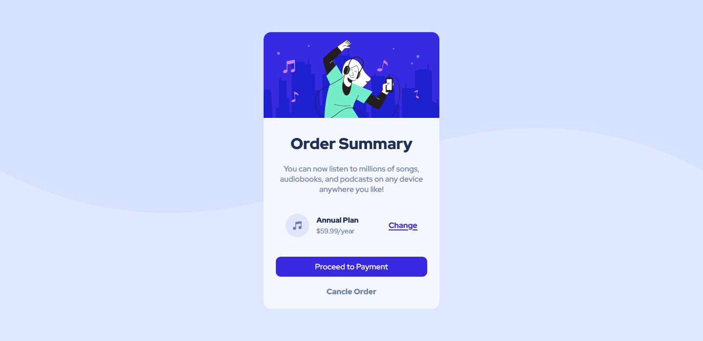
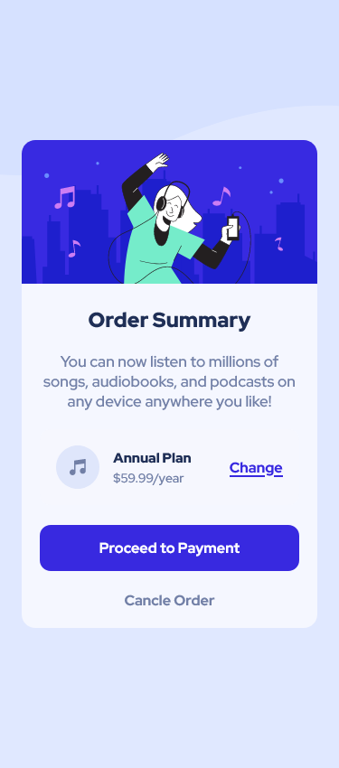

# Frontend Mentor - Order summary card solution

This is a solution to the [Order summary card challenge on Frontend Mentor](https://www.frontendmentor.io/challenges/order-summary-component-QlPmajDUj). Frontend Mentor challenges help you improve your coding skills by building realistic projects. 

## Table of contents

- [Overview](#overview)
  - [The challenge](#the-challenge)
  - [Screenshot](#screenshot)
  - [Links](#links)
- [My process](#my-process)
  - [Built with](#built-with)
  - [What I learned](#what-i-learned)
  - [Continued development](#continued-development)
- [Author](#author)


## Overview

### The challenge

Users should be able to:

- See hover states for interactive elements

### Screenshot




### Links

- Solution URL: [Solution URL here](https://github.com/shafiuljony/order-summary
- Live Site URL: [Live site URL here]https://shafiuljony.github.io/order-summary/)

## My process

### Built with

- HTML5 markup
- CSS custom properties
- Flexbox

### What I learned

```html
 <div class="container">
        <div class="hero">
          
        </div>
        <div class="card-content">
            <h2 class="title">Order Summary</h2>
            <p class="subtitle">You can now listen to millions of songs, audiobooks, and podcasts on any device anywhere you like!</p>
            <div class="plan-box">
              <div class="left-content">
                
                <div class="content">
                  <h5>Annual Plan</h5>
                  <p>$59.99/year</p>
                </div>
              </div>
              <div class="right-content">
                <a href="#">Change</a>
              </div>
            </div>
            <a href="" class="payment-btn">Proceed to Payment</a>
            <a href="" class="cancle-btn">Cancle Order</a>
        </div>
  </div>
 
```
```css
a.payment-btn{
    color: #fff;
    display: block;
    text-decoration: none;
    background-color: var(--bright-blue);
    padding: 15px 0;
    border-radius: 10px;
    margin-top: 22px;
    margin-bottom: 22px;
    font-weight: 700;
}
```

### Continued development

I wanted TO continue Focusing On css and js also react

## Author

- Website - [Md.Shafiul Islam](https://shafiul-islam-portfolio.netlify.app/)
- Frontend Mentor - [@shafiuljony](https://www.frontendmentor.io/profile/shafiuljony)
- Twitter - [@shafiul_islam12](https://www.twitter.com/shafiul_islam12)
